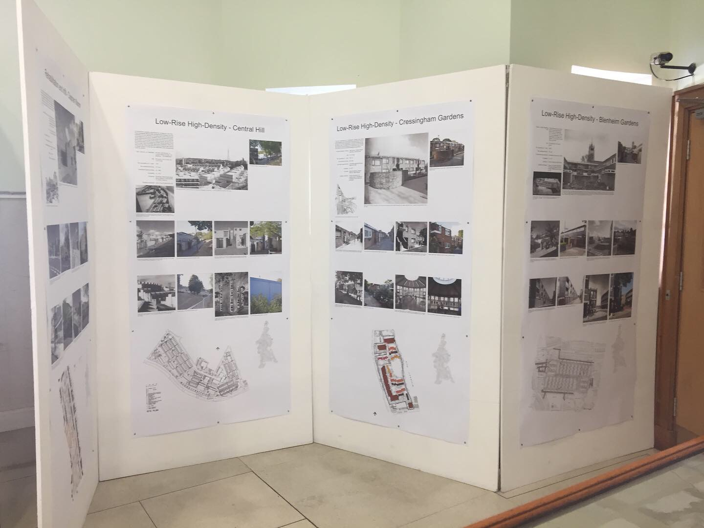

# Process Notes

I think the whole exhibition is driven by the map as a navigation source.

Then each panel is a IIIF Manifest (i.e., an individual exhibition in Delft / ME terms).

Digirati resources:

https://exhibitionviewer.org/docs/creating-exhibitions

https://digirati-workshops.pages.dev/exhibition-building/

https://heritage.tudelft.nl/en/exhibitions

https://leedsunilibrary.exhibitionviewer.org/marie-hartley


## The map

This produces level 0 static tiles.

### Convert PDF to PNG with GhostScript:

https://ghostscript.readthedocs.io/en/gs10.05.1/Use.html

```
gs -dSAFER -dBATCH -dNOPAUSE -sDEVICE=png16m -r400 -sOutputFile='map400.png' '.\84cm x 178.2cm 180g matte_Exhibition Layouts 220823_p1.pdf'
```

(400 dpi)

### Crop the png to remove text and extra whitespace

(Don't need images and panel text in the deep zoom map image itself)


### Create IIIF tiles from PNG using VIPS

```
vips dzsave map.png map --layout iiif

'C:\Program Files\vips\vips-dev-8.17\bin\vips.exe' dzsave '<file>' <name_part> --layout iiif
```

### Now create a Manifest for the map

(in the manifest editor)

## Links in the map

Many of the red entries on the RHS of the map will feature on the "exhibition" panels; these should link into the panels where possible.

This is done with linking annotations.

# Possible TODOs

Allmaps integration?

overlay map / open streetmap tiles

What is the landing page? The map? Or the Intro text?


# Static IIIF for all the images

This creates the static tiles, thumbnails and /full/max/, in jpeg and webp versions, as will as info.json and a single-image wrapper manifest for viewers:

```
.\StaticIIIF.exe 'C:\Users\TomCrane\Dropbox\personal\Lambeth Archives\220825_Exhibition Lambeth Archives 2208\Exhibition Layouts 220823 Folder\Links\09414.jpg' 'C:\git\tomcrane\yesterdays-lambeth-today\iiif-img\09414'
```

(see https://github.com/tomcrane/static-iiif/blob/main/src/StaticIIIF/StaticIIIF/Program.cs)

These have been gathered together (automated by the various Python scripts) into this single Manifest **which can then be used in the IIIF Browser** to quickly pick IIIF resources!

https://theseusviewer.org/?iiif-content=https://tomcrane.github.io/yesterdays-lambeth-today/iiif/yesterday-and-today.json


# Implementation Notes

> Assume that the IIIF Preparation described above has been done - this requires more technical knowledge - but you could have used IIIF-CS and just uploaded all the raw images instead. I wanted them all to be static for this, though, hence all the above palaver. So our starting point is:

* a [nice Manifest](https://theseusviewer.org/?iiif-content=https://tomcrane.github.io/yesterdays-lambeth-today/iiif/yesterday-and-today.json) with all the source images, for picking from in tools.
* PDFs of the physical panels that I can grab text from, and use to crop by eye where images need cropping.

In my spare time recently I've been trying to build an exhibition with the Manifest Editor and Exhibition builder.
It's an online version of a (real) small physical exhibition that mostly comprised display panels with text and images, ideal for transforming into an online exhibition.

Here's a part of it, these are representative of the panels I'm tackling first:



There are also 3D models (i.e., physical architectural models), documents and other bound objects in cases (which have been digitised so could be viewed in a linked viewer), as well as video interviews, large drawings and other material. I want to get the panels done first as they most closely align (I think) with what we have done so far with exhibition building. All these other things are very typical of small exhibitions, though.

I have just been fiddling about with one of the panels, and the map so far, before I then do all the panels quickly having established the process.

I think that the "exhibition" as a whole is actually multiple IIIF Manifests, one for each panel, and therefore multiple Delft-style exhibitions. There's also a map that in physical form was usefully informative, but in online form is potentially much more useful as a navigation device - linking to the different panels. Several locations on the map will link to the same "exhibition" (panel).

I think that the published exhibition has an index.html that provides an introduction ([placeholder here](https://tomcrane.github.io/yesterdays-lambeth-today)), and the map navigation, and then each panel is another HTML page that is mostly the embedded Delft view, but has a little navigation to get back to the map view. Individual Canvases in the panels could also link back to a particular annotation in the Map view, showing you exactly where the picture is.

I have experimented with the map as *tour steps*, and as a plain Manifest in Theseus. The annotations should probably be `linking` annotations but at the moment are `describing`, with a link in the text to the panel page (just a link to the external Delft viewer so far).

None of these modes really work for the use case though, so I started to see what a more custom map page would look like with Canvas Panel + linking annotations. This hasn't worked, as explained below.

Map navigation - in Theseus:
 
* https://theseusviewer.org/?iiif-content=https://tomcrane.github.io/yesterdays-lambeth-today/iiif/map-nav.json

In various exhibition viewers:
* https://exhibitionviewer.org/preview/delft?manifest=https://tomcrane.github.io/yesterdays-lambeth-today/iiif/map-nav.json
* https://exhibitionviewer.org/preview/presentation?manifest=https://tomcrane.github.io/yesterdays-lambeth-today/iiif/map-nav.json
* https://exhibitionviewer.org/preview/minimal?manifest=https://tomcrane.github.io/yesterdays-lambeth-today/iiif/map-nav.json

None of these are really going to do the job, so I tried this:

https://tomcrane.github.io/yesterdays-lambeth-today/map.html

(Ultimately I would combine the map with the intro page, placeholder here: https://tomcrane.github.io/yesterdays-lambeth-today/)

The reason this doesn't work is that it's a IIIF Image API v3 Image Service, which expects `size` param requests to be of the form `/w,h/`, but Canvas Panel is requesting them in the v2 Canonical Form `/w,/`. These are **static** tiles, hosted on GitHub, and as a level 3 service I only generated them in the `/w,h/` form - so all the tiles are 404s.

If it did work, I assume I would write some script to grab the annotations, and make them interactive, using https://iiif-canvas-panel.netlify.app/docs/examples/annotations as a starting point. I am not sure if there's a simpler way though. The general case here is a Canvas as a navigation device, with linking annotations going to different HTML pages - a map is just one version of this.

Parking the map for now, here is the first exhibition Panel:

Panel 2 manifest:

* https://tomcrane.github.io/yesterdays-lambeth-today/iiif/panels/p02-high-rise-pentagonal-blocks-crop.json

In Theseus:

* https://theseusviewer.org/?iiif-content=https://tomcrane.github.io/yesterdays-lambeth-today/iiif/panels/p02-high-rise-pentagonal-blocks-crop.json

In Delft:

* https://exhibitionviewer.org/preview/delft?manifest=https://tomcrane.github.io/yesterdays-lambeth-today/iiif/panels/p02-high-rise-pentagonal-blocks-crop.json

On the original panels the modern (colour) images were cropped to approximate the archive image. My image services are bulk-generated from the original images, not the crop, so I need to crop _at the IIIF level_ using a `SpecificResource` body rather than a direct `Image`.

I don't think I can do this in the Manifest Editor (can I?), but I can do it by hand as a `SpecificResource`. I modified two of the Canvases in this Manifest (by hand) to achieve this.

The SpecificResource works fine on Canvas 8 (compare the Canvas view with its thumbnail which is still the original image aspect ratio). But exactly the same approach does **not** work on Canvas 12. I can't see that I've done anything different - you can see both in Theseus and the Delft view that it remains uncropped. (Possibly I have done something stupid that I will eventually spot).

## Manifest Editor pain points

The above is about process - the following is about specific tools.

* Add content -> Pasting in list of images should give more options, not just make canvases. 
* List of images doesn't analyse URLs when you paste in image services (it used to do this!)
* Support for Choice - that panel could also be done as `Choice` between the old and new photos
* Should be able to set base URL for Manifest - I am storing the Manifests in GitHub and I know what the `id` is going to be
* Working on a published Manifest and loading from URL is very messy - reopening it from  URL doesn't replace previous opened from URL in the project history. The only way I could reliably work on the Manifests, where I'm manually downloading the JSON and updating GitHub, is to delete the projects and open from the URL fresh each time, it gets very confused otherwise. I think this scenario might be common, in the absence of direct GitHub integration; the ME could be more aware that the currently-editing Manifest is available on the web at its `id`, when loading from history, comparing project state with published, etc.
* (The manifest's id should be significant)
* HTML fields should be trimmed
* Thumbnail not analysed as image service (again when pasting in an image for a thumbnail)
* Adding a thumbnail to a manifest explicitly as a service puts the whole service JSON in including @context, `tiles` etc, rather than just the bits needed for the reference. The `@context` should definitely not be there.
* Ability to crop the source image in the ME - it knows what's going on and won't break the SpecificResource, but you can't create of edit a specific resource - so I had to drop to hand-editing the manifest as described above. 
* (would also need to use SpecificResource as Choice items)


